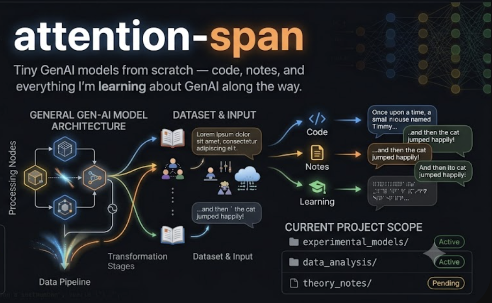
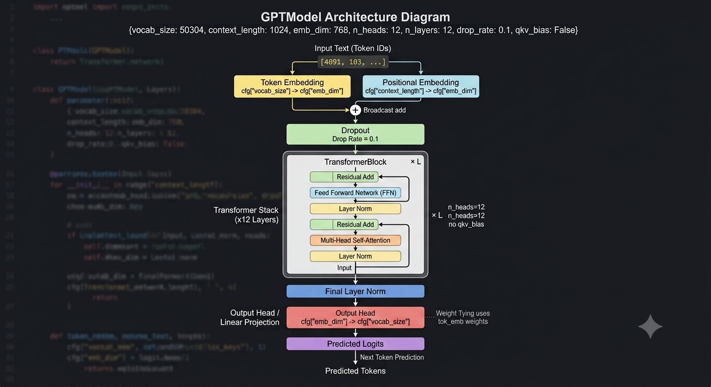
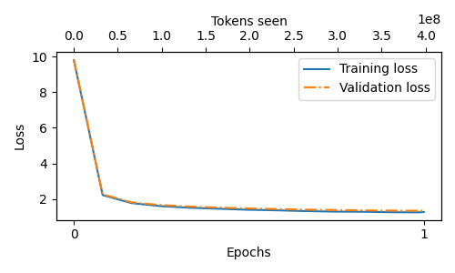

# attention-span



Tiny GenAI models from scratch — code, notes, and everything I'm learning about GenAI along the way.

This repo documents from-scratch implementations and training runs of small language
models, organized by model family under `training/`. The first entry is a GPT-124M-style
model trained on the [TinyStories](https://huggingface.co/datasets/roneneldan/TinyStories)
dataset — more model families will be added over time.

---

## What's in this repo

```
attention-span/
├── training/
│   └── gpt/
│       ├── train_gpt.py                          # GPT-124M training script (this project)
│       ├── tinystories_alpaca_train_sample.jsonl  # Sample Alpaca-style instruction dataset (see notebook below)
│       ├── loss_plot.png                         # Loss curve from the training run below
│       └── gpt-architecture.png                  # GPTModel architecture diagram
├── notebooks/
│   └── gpt/
│       ├── Pretraining_GPT2.ipynb              # Deep-dive notebook: builds the model + optimizations step by step
│       └── prepare_instruction_dataset.ipynb   # Builds an Alpaca-style instruction dataset from TinyStories
├── notes/                     # Learning notes on transformer internals & training optimizations
└── checkpoints/               # (gitignored) Trained model checkpoints — not committed
```

`training/` is organized by model family (`gpt/`, and future additions like `llama/`,
`mistral/`, etc. as this repo grows) — each subfolder is self-contained with its own
training script and, if needed, its own architecture-specific helper modules.

---

## GPT-124M (`training/gpt/`)

A GPT-2-small-equivalent architecture, built from scratch:

- **~124M parameters** (with weight tying between token embedding and output projection)
- 12 layers, 12 attention heads, 768 embedding dimension, 1024 context length
- Vocabulary size rounded to 50,304 (nearest multiple of 64) for tensor-core-friendly shapes



## Dataset

[TinyStories](https://huggingface.co/datasets/roneneldan/TinyStories) — a dataset of short,
simple children's stories, designed for training small language models that can still
produce coherent narrative text.

---

## Instruction dataset (Alpaca-style, from TinyStories)

TinyStories has no natural instructions — just plain short stories. To use it for
instruction fine-tuning, [`notebooks/gpt/prepare_instruction_dataset.ipynb`](notebooks/gpt/prepare_instruction_dataset.ipynb)
synthesizes `{instruction, input, output}` triples from the raw text via four templates
(story continuation, opening-sentence completion, keyword-constrained generation, and free
generation), each story randomly assigned 2 of the 4 templates.

A sample of the resulting dataset is at
[`training/gpt/tinystories_alpaca_train_sample.jsonl`](training/gpt/tinystories_alpaca_train_sample.jsonl)
(3,991 examples built from 2,000 stories) — refer to it to see the exact JSONL shape expected
for instruction fine-tuning.

---

## Optimizations implemented

Built up incrementally, each one addressing a specific bottleneck encountered along the way:

**Architecture**
- Weight tying (token embedding ↔ output projection)
- GPT-2 / nanoGPT-style weight initialization (`std=0.02`, credit: [Andrej Karpathy's nanoGPT](https://github.com/karpathy/nanoGPT))
- Residual-stream output scaling (`NANOGPT_SCALE_INIT`) to control activation variance across depth
- FlashAttention via `torch.nn.functional.scaled_dot_product_attention` — eliminates the need to materialize the full attention score matrix in memory

**Precision & compute**
- TF32 matmul precision on Ampere+ GPUs
- bfloat16 mixed precision (`torch.autocast`)
- `torch.compile` for kernel fusion

**Optimizer & training dynamics**
- Custom parameter grouping: weight decay only on 2D+ parameters (matrices), not biases/LayerNorm
- Fused AdamW (auto-detected based on PyTorch version + CUDA availability)
- Cosine learning rate schedule with linear warmup
- Gradient clipping (global norm, capped at 1.0)
- Gradient accumulation, to simulate a larger effective batch size than fits in memory at once

**Data pipeline**
- Tokenize → concatenate → sliding-window chunk into fixed-length `(input_ids, target_ids)` pairs
- `<|endoftext|>` token appended after each story, giving the model an explicit document-boundary signal before concatenation

**Inference**
- Greedy decoding (`generate_text_simple`) and sampling-based decoding with temperature + top-k (`generate_text_sampled`) — sampling meaningfully reduces repetitive output compared to pure greedy decoding

---

## Results

Produced on a single A100 (40GB) using the Colab command shown in
[Running the training script](#running-the-training-script) below.

One epoch, ~398M training tokens. Trained on Google Colab using an NVIDIA A100-SXM4-40GB GPU (Ampere architecture family).

**Approximate cost to reproduce:** \~15 Colab compute units (\~$1.50 at $0.10/unit, rounded
up from the \~11 units the measured runtime implies, to leave headroom for Colab's variable
consumption rate), based on the measured 45m 35s training time and Colab's published A100 rate
of roughly 13–15 compute units/hour. Actual cost may vary with Colab's current pricing —
check [Colab's pricing page](https://colab.research.google.com/signup) for up-to-date rates.

| Metric | Value |
|---|---|
| Final train loss | 1.276 |
| Final val loss | 1.350 |
| Total training time | 45m 35s |
| Peak GPU memory | ~15.3 GB |
| Avg tok/sec | ~148,284 |

Train and validation loss track closely throughout training, with no signs of overfitting.
Loss converges quickly and plateaus by roughly 30% of the way through the epoch.



**Training log — before vs. after:**

First step (model is still random noise) vs. the final step (6072/6072), showing train/val
loss dropping from \~9.8 to \~1.3 and throughput ramping up to a steady-state \~148k tok/sec.
(Device: NVIDIA A100-SXM4-40GB, 39.49 GB total memory, for both steps below.)

*Before training (Step 0):*

```
Maximum GPU memory allocated: 0.5 GB
  0% 1/6072 [00:38<64:31:11, 38.26s/it]Ep 1, Step 000000 | Train loss: 9.802 | Val loss: 9.835 | norm: 17.9942 | LR: 0.000060 | Step tok/sec: 1713 | Avg tok/sec: 0
Once upon a time....................................................................................................
```

*After training (Step 6071, final):*

```
Maximum GPU memory allocated: 15.3 GB
100% 6072/6072 [45:21<00:00,  2.39it/s]Ep 1, Step 006071 | Train loss: 1.276 | Val loss: 1.350 | norm: 0.2517 | LR: 0.000060 | Step tok/sec: 123565 | Avg tok/sec: 148284
Once upon a time, there was a little girl named Lily. She loved to play outside in the sunshine. One day, she saw a big, scary dog. The dog was barking loudly and Lily was scared. She ran to her mommy and said, "Mommy, there's a scary dog outside!"   Mommy said, "Don't worry, Lily. The dog is friendly. He just wants to play."   Lily felt better and went back outside to play. She saw
```

**Sample generation** (prompt: *"Once upon a time, in a"*) — effect of temperature on decoding:

*temperature=0.0 (greedy, deterministic):*

> Once upon a time, in a small town, there was a little girl named Lily. She loved to play with
> her toys and run around outside. One day, she saw a big, red ball in the park. She wanted to
> play with it, but it was too high for her to reach. Lily asked her...

*temperature=0.7:*

> Once upon a time, in a small town, there was a little boy named Tim. Tim was a good boy who
> always tried his best. One day, Tim saw a big, red ball in the park. He ran to get it, but a
> big dog was behind him. "Hey, that's my ball!"

*temperature=1.0:*

> Once upon a time, in a small village, there was a little boy named Tim. Tim had a small dog
> named Max. They loved to play together every day. One day, Tim and Max were playing near a
> tree when they saw a boy named Mark. Mark was an honest boy who liked to tell off jokes.

At temperature=0.0 the output is fully deterministic (same prompt always yields the same
continuation); higher temperatures introduce more lexical variety and narrative divergence
while staying coherent. See `notes/` for additional generation samples across different
decoding strategies.

---

## Running the training script

**`training/gpt/train_gpt.py` is the script to use for training GPT** — it consolidates
every optimization listed above into a single, ready-to-run script. Works identically in
Colab and on a remote GPU cluster via VS Code — no code changes needed.

For a deep dive into *how* the model and each optimization were built up incrementally
(architecture, weight tying, FlashAttention, mixed precision, optimizer setup, etc.), see
[`notebooks/gpt/Pretraining_GPT2.ipynb`](notebooks/gpt/Pretraining_GPT2.ipynb) — it walks
through constructing the model from scratch, step by step.

**Google Colab**
```bash
!python training/gpt/train_gpt.py --num_epochs 1 --micro_batch_size 16 --grad_accum_steps 4 --eval_freq 500 --checkpoint_dir /content/sample_data
```
*(the exact command used to produce the results reported above)*

**VS Code / remote GPU cluster (terminal)**
```bash
python training/gpt/train_gpt.py \
  --num_epochs 1 \
  --micro_batch_size 16 \
  --grad_accum_steps 4 \
  --eval_freq 500 \
  --eval_iter 50 \
  --checkpoint_dir ./checkpoints
```

Run `python training/gpt/train_gpt.py --help` for the full list of configurable
hyperparameters (learning rate, warmup steps, checkpoint retention, `torch.compile`
toggle, etc.).

### Requirements

```
torch==2.4.1+cu124
tiktoken==0.8.0
transformers==4.48.2
datasets==3.2.0
safetensors==0.5.2
tqdm==4.67.1
matplotlib
```

A CUDA-capable GPU is strongly recommended (developed and tested on an NVIDIA A100-SXM4-40GB, Ampere architecture family). TF32 and bfloat16 mixed-precision optimizations in the training script specifically target Ampere+ GPUs (Volta 7.0+, Turing 7.5+, Ampere 8.0+, Hopper 9.0+).

---

## Parameters worth experimenting with

All configurable via CLI flags on `train_gpt.py` (run `--help` for the full list).
A few worth trying beyond the defaults used for the reported results:

**Batch size & effective batch size**

| Flag | Default | What to try |
|---|---|---|
| `--micro_batch_size` | 16 | Largest that fits in GPU memory — bigger means better utilization |
| `--grad_accum_steps` | 1 | Raise to simulate a larger effective batch (`micro_batch_size × grad_accum_steps × context_length` tokens/step) without more memory |

**Learning rate & schedule**

| Flag | Default | What to try |
|---|---|---|
| `--max_lr` | 6e-4 | Lower (3e-4) for stabler/slower convergence; higher (1e-3) is faster but risks instability — watch `norm` for spikes |
| `--warmup_steps` | 10 | Longer (100–500) helps larger models or higher `max_lr` |
| `--weight_decay` | 0.1 | Standard GPT-2/GPT-3 value; lower if underfitting |

**Training length**

| Flag | Default | What to try |
|---|---|---|
| `--num_epochs` | 1 | More epochs help on larger/more diverse datasets (less useful on TinyStories alone — loss plateaued by ~30% through one epoch) |

**Evaluation & checkpointing**

| Flag | Default | What to try |
|---|---|---|
| `--eval_freq` | 500 | Lower for closer monitoring on short runs; raise on long runs to cut eval overhead |
| `--eval_iter` | 50 | More batches = more stable loss estimate, at the cost of eval speed |
| `--keep_last_n_checkpoints` | 3 | Raise for a longer checkpoint history |

**Compute/precision**

| Flag | Default | What to try |
|---|---|---|
| `--compile` / `--no-compile` | `--compile` | Disable on `torch.compile` errors, or for very short runs where compile overhead isn't worth it |

**Model architecture** (hardcoded in `GPT_CONFIG_124M`, not yet CLI flags):

| Parameter | Default | What to try |
|---|---|---|
| `context_length` | 1024 | Shorter (256) cuts memory/compute (attention scales quadratically) for faster experimentation |
| `n_layers` / `n_heads` / `emb_dim` | 12 / 12 / 768 | Scale up together for a larger model (e.g. GPT-2 medium: 24 / 16 / 1024) |
| `drop_rate` | 0.1 | Lower (or 0.0) if underfitting; TinyStories may not need much dropout |

**Inference / decoding** (`generate_text_sampled`)

| Parameter | Default | What to try |
|---|---|---|
| `temperature` | 1.0 | 0.0 for greedy/deterministic; 0.7–0.9 for coherent variety; 1.0+ for more randomness |
| `top_k` | `None` | 40–50 filters out unlikely tokens while keeping variety |

---

## What's next

- Test coherence over longer generations (500+ tokens)
- Try a larger model size (355M) for comparison
- Explore training on a more diverse dataset beyond TinyStories
- Train on [OpenWebText2](https://openwebtext2.readthedocs.io/en/latest/) with multi-GPU
  (DDP) support, to scale beyond a single-GPU, single-dataset setup
- Add training scripts for other model families under `training/` (e.g. Llama-style architectures) as I explore them

---

## Credits

- [Andrej Karpathy's nanoGPT](https://github.com/karpathy/nanoGPT) — architecture and
  training conventions referenced throughout (`NANOGPT_SCALE_INIT`, vocab size rounding,
  fused AdamW, cosine LR schedule)
- [Sebastian Raschka](https://github.com/rasbt) — code structure and training loop
  conventions (loss/eval helpers, sample generation during training) draw heavily on
  his "Build a Large Language Model From Scratch" approach
- [TinyStories dataset](https://huggingface.co/datasets/roneneldan/TinyStories) (Eldan & Li)
- OpenAI's GPT-2 — base architecture reference
